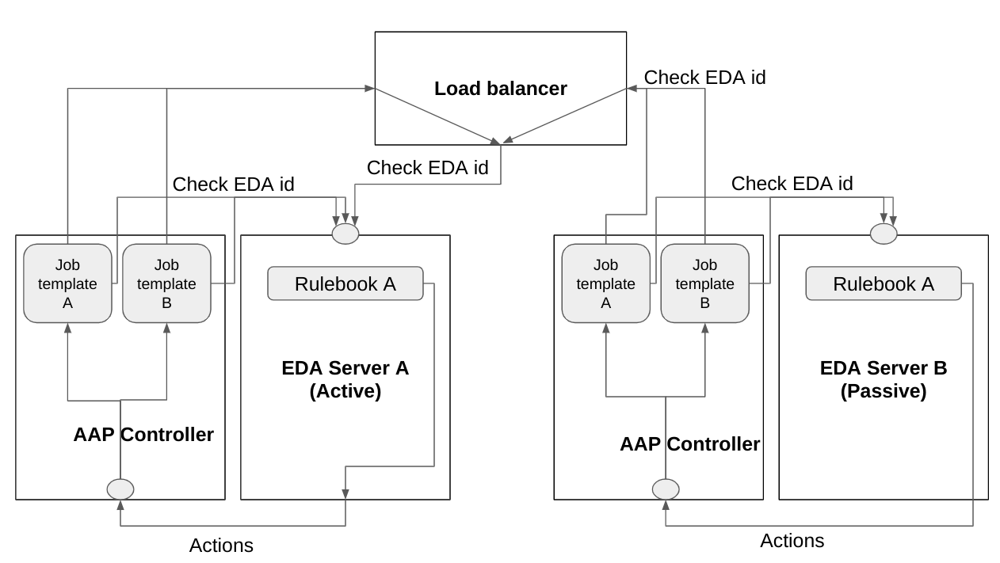

Role Name
=========

A role which provides high availability for a Event Driven Ansible server.
It requires you to setup two or more independent EDA servers and put a load balancer infront of them.
Load balancer needs to do active-passive balancing between your EDA servers.



As you create playbooks which runs as actions to events, you include this role as shown in the example and depend tasks on the eda_activation boolean.
This will ensure that actions are only taken when an EDA server is "activated", meaning, the one getting load balanced to.

Fail-over between active and passive will be at the speed that the load balancer detects an outage, normally around a second.

Install using:
```
ansible-galaxy role install mglantz.eda-ha
```

Requirements
------------

Create the file: /var/lib/ansible-automation-platform/eda/ui/static/media/detect.json on each EDA server, as follows:
```
{
   "install_id": "unique_id_that_you_make_up_fqdn_perhaps"
}
```

Role Variables
--------------
```
# domain name of load balancer in front of EDA servers
load_balancer_fqdn: <string|fqdn of load balancer> 

# domain name of eda server, suggestion, if AAP, set in job_template
eda_fqdn: <string|fqdn of eda server>

# if we are to validate https certificate. if set to true, all EDA servers needs to have valid certs
# also includes connection via load balancer
validate_eda_tls_cert: <bool|true/false>
```

Dependencies
------------

* Two or more installed instance of https://github.com/ansible/eda-server or Red Hat Ansible Automation Platform with EDA controller.
* A load balancer, configured to do active-passive load balancing.
* Adjusted action taking playbooks

Example Playbook
----------------

An example of how to use the role.
In the action taking playbooks, the ones triggered by EDA events, adjust them as follows:
```
---
- name: Detect which EDA server is active and set eda_activation accordingly
  hosts: localhost
  roles:
    - { role: mglantz.eda-ha, load_balancer_fqdn: "loadbalancer.sudo.net", eda_fqdn: "eda.sudo.net" }

- name: Site is up
  hosts: all
  vars:
    eda_activation: "{{ hostvars['localhost']['eda_activation'] }}"
  gather_facts: false
  tasks:
    - debug:
        msg: "All is up and well"
      when: eda_activation

    - name: Do something else
      ansible.builtin.debug:
        msg: "Imaginary something else"
      when: eda_activation
```

License
-------

GPL 3.0

Author Information
------------------

* Magnus Glantz, sudo at redhat.com, 2023
* Roberto Nunez, rnunez at redhat.com, 2023
