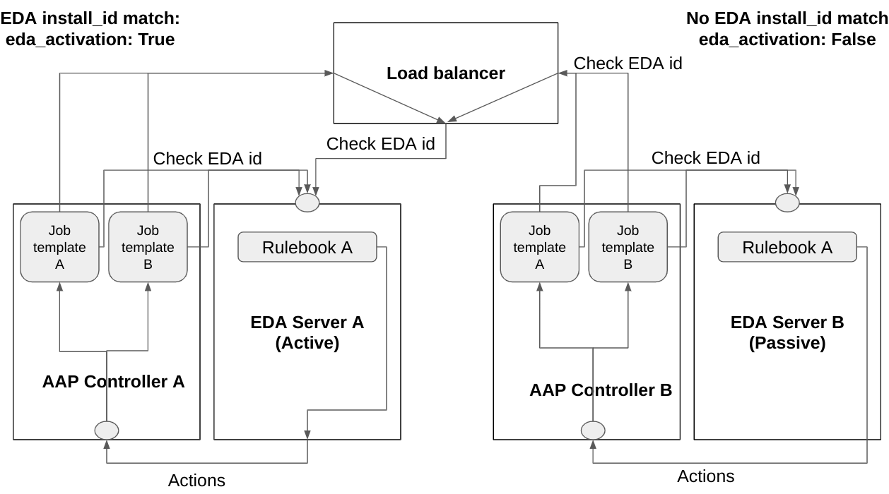

Role Name
=========

A role which provides high availability for a Event Driven Ansible server.
It requires you to setup two or more independent EDA servers and put a load balancer infront of them.
Load balancer needs to do active-passive balancing between your EDA servers.



As you create playbooks which runs as actions to events (which likely will be connected to job_templates), you include this role as shown in the example and depend tasks in the playbooks on the eda_activation boolean. If this boolean is true, that means the EDA server in question is active, if it's not, it means it's passive and no tasks should be run. So actions are only taken when an EDA server is "activated", meaning, the one getting load balanced to.

Fail-over between active and passive will be at the speed that the load balancer detects an outage, normally around a second. 
This is as the only difference between EDA Server A and B and corresponding AAP Controllers, is that tasks only get executed when triggered from the active EDA server. No configuration differs on the EDA server side.

Install role using:
```
ansible-galaxy role install mglantz.eda-ha
```

To use this role in your playbooks, create a requirements.yml file which you put in your roles directory.
The requirements.yml file needs to state:
```
---    
- name: mglantz.eda-ha
```
Example of this can be seen here: https://github.com/mglantz/event-driven-ansible-demo/

Requirements
------------

* Create the file: /var/lib/ansible-automation-platform/eda/ui/static/media/detect.json on each EDA server, as follows:
```
{
   "install_id": "unique_id_that_you_make_up_fqdn_perhaps"
}
```
* Two or more installed instance of Red Hat Ansible Automation Platform 2.4 with EDA controller, or perhaps https://github.com/ansible/eda-server (upstream eda-server has not been tested though).
* A load balancer, configured to do active-passive load balancing.
* Adjusted playbooks as described below, which makes use of this role.

Role Variables
--------------
```
# domain name of load balancer in front of EDA servers
load_balancer_fqdn: <string|fqdn of load balancer> 

# domain name of eda server, suggestion, if AAP, set in job_template
eda_fqdn: <string|fqdn of eda server>

# if we are to validate https certificate. if set to true, all EDA servers needs to have valid certs
# also includes connection via load balancer
validate_eda_tls_cert: <bool|true/false>
```

Dependencies
------------


Example Playbook
----------------

An example of how to use the role.
In the action taking playbooks, the ones triggered by EDA events, adjust them as follows:
```
---
# Below play needs to be in the top of your playbooks
- name: Detect which EDA server is active and set eda_activation accordingly
  hosts: localhost
  roles:
    - { role: mglantz.eda-ha, load_balancer_fqdn: "loadbalancer.sudo.net", eda_fqdn: "eda.sudo.net" }

- name: Site is up
  hosts: all
  vars:
# Below variable needs to be added to the play which does your actual actions
    eda_activation: "{{ hostvars['localhost']['eda_activation'] }}"
  gather_facts: false
  tasks:
    - debug:
        msg: "All is up and well"
# Add below when statement for tasks that you want to control or equivalent for a block statement
      when: eda_activation

    - name: Do something else
      ansible.builtin.debug:
        msg: "Imaginary something else"
      when: eda_activation
```

License
-------

GPL 3.0

Author Information
------------------

* Magnus Glantz, sudo at redhat.com, 2023
* Roberto Nunez, rnunez at redhat.com, 2023
